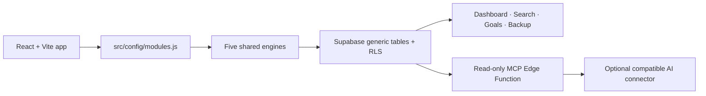

# Everyday

> **Everyday is a personal operating system for daily life, built from reusable tracking engines rather than dozens of isolated apps.**

## The problem

Daily life is usually split between a calorie counter, budget app, habit tracker, task list, link saver, reminders, and more — each with its own data and its own idea of what matters. Moving between them means repeatedly rebuilding context, while the question that actually matters — “how is my week going?” — has no single answer. The data is there, but it is siloed, so it is hard to see patterns or reflect before the next decision. Everyday brings those records into one app, one data model, and one place to get useful answers instead of another pile of logs.

## The solution

Everyday solves this with two layers.

**Layer one: the application layer.** More than 40 daily-life tools live in one place: budget, calories, habits, tasks, saved links, reminders, and more. They are built on five reusable engines rather than 40 separate rewrites. See [What’s inside](#whats-inside) below.

**Layer two: the metacognitive layer.** A read-only MCP server lets ChatGPT or Claude reason directly over that data. People already review a budget or calorie trend to understand their patterns — often with an AI’s help. This layer lets that AI pull the real data directly instead of making someone copy-paste numbers into a chat by hand.

Beyond bringing everything into one place, this design solves two problems most “all-in-one” apps do not:

1. **Zero setup for the user.** No server to run and nothing to deploy: open one configured HTML file, and data reads and writes directly to the cloud. This matters more than it sounds. A good idea that requires real setup effort loses most people before they ever use it; tell ten people “this app is great, but you need to configure a server first,” and most will not bother. Tell them “click this one file,” and they will. Everyday is built for the second version.

2. **One place instead of a dozen.** A saved Instagram reel sits in a chat thread. A packing list lives in Notes. A watchlist is pinned on a movie site that rarely gets opened. Budget lives in one subscription app, calories in another. Nothing talks to anything else, and finding any one thing means remembering which silo it is in. Everyday exists so all of that lives in one place, with one shared way to actually use it.

## Layer two in detail — your data, wherever you already think

Everyday exposes a user’s own data to ChatGPT and Claude through a real, read-only MCP server, secured with a revocable personal token. Someone can ask “How is my week going?” or “Check my goal progress” and get an answer grounded in their actual calories, spending, habits, tasks, and reminders.

Both ChatGPT and Claude were connected and verified end-to-end during development. That testing found a real issue: an AI noticed that a 73.2 kg weight record was being reported as 100% complete toward a 70 kg goal. The bug was in the descending-goal calculation, not the demo data; it was fixed and covered by a regression test.

The result is not a feature bolted onto a tracker. It is the reflection layer the application data was built to support.

## What's inside

### 📊 Trackers (EntryTracker)

Log a number and see the right view of it over time: daily totals, running trends, category breakdowns, or snapshots.

Calories · Budget · Water Intake · Weight · Steps · Time Tracking · Subscriptions · Savings Goal · Net Worth · Investments

### ✅ Lists (Checklist)

Capture an item, keep it organised, and check it off without losing its completed history.

Todo · Grocery List · Watchlist · Bucket List · Gift Ideas

### 🔥 Streaks (StreakTracker)

Check in for today, protect the chain, and review the days you showed up.

Exercise · Medication · Meditation · Habit Tracker · Language Learning · Skill Practice · Gratitude Log

### 💾 Saved (SavedItems)

Keep useful references with notes, tags, and fields that make them easy to find later.

Link Saver · Journal · Reading List · Contacts · Recipe Box · Idea Inbox · Quote Collector

### 📅 Reminders (DueDateTracker)

See what is due next, what is overdue, and what has already been completed.

Debt Payoff · Remittance Log · Chore Schedule · Package Tracker · Warranty Tracker · Document Expiry · Vehicle Maintenance · Course Tracker

### Plus the meta layer

Dashboard · Goals · Global Search · Backup / Export / Import · Connect to AI (read-only MCP)

**41 catalog features, five reusable engines.** The 37 engine modules are configuration entries rather than 37 separate rewrites; the meta layer works across them.

The catalog contains **37 engine modules**: the 36 planned core modules plus Investments, an additional tracker. Combined with the four original catalog meta features—Dashboard, Goals, Global Search, and Backup/Import—that is **41 built/configured catalog features overall**. Connect to AI/MCP is an additional integration surface and is not included in that catalog count.



| Engine | Examples |
|---|---|
| EntryTracker | Calories, Budget, Weight, Savings, Investments |
| Checklist | Todo, Grocery, Watchlist |
| StreakTracker | Exercise, Habits, Gratitude |
| SavedItems | Links, Journal, Contacts, Recipes |
| DueDateTracker | Packages, Chores, Documents, Courses |

## Quick Start — core UI preview

For a fast, no-account preview of the interface, install the committed dependencies and build the self-contained frontend:

```bash
npm ci --ignore-scripts --audit=false
npm run build
```

Open `dist/index.html` directly in a browser. The module navigation and frontend UI load without a Supabase project; data persistence and live records require the setup below. For a working core app backed by your own data, continue with the full setup rather than treating this preview as a complete installation.

## Advanced setup — working Supabase app + MCP server

Follow this sequence in order for a fresh Supabase project. It includes the MCP fixes required for the working deployment: anonymous auth, RLS grants, No auth connector support, token lookup, data reads, and goal calculations.

### 1. Prerequisites

- Node.js 18 or newer and npm.
- A Supabase account.
- A new Supabase project you control. Everyday does not create a project for you.

### 2. Create the Supabase project and configure Data API

1. In the Supabase Dashboard, create a new project and wait until it is ready.
2. During creation, or later in **Project Settings → Data API**, confirm these settings:

| Setting | Value | Why it matters |
|---|---|---|
| **Enable Data API** | **ON** | Required for `supabase-js`, which is how Everyday reads and writes database records. |
| **Automatically expose new tables** | **OFF** | Keeps new public-schema tables unavailable to Data API roles until this project’s SQL grants the exact access they need. |
| **Enable automatic RLS** | **ON** | Makes a new table start protected by Row Level Security before its specific policies are added. |

Everyday’s migrations explicitly grant the browser’s `authenticated` role and the server-only `service_role` the required permissions, then enable RLS and add owner-scoped policies. Leaving automatic table exposure off is therefore the intended and least-privilege setup; it does not prevent the documented migrations from working.

### 3. Configure Everyday’s Supabase client

1. In your Supabase project, open **Project Settings** (the gear icon in the left sidebar), then choose **API** or **API Keys**, depending on the Dashboard version.
2. Copy these browser-safe values and keep them ready for step 4:

   - **Project URL** — near the top; it looks like `https://abcdefghijklmnop.supabase.co`.
   - **anon / public key** — called a **publishable** key in newer dashboards; it is a long string often beginning with `eyJ...`.

   Do **not** copy the `service_role` / **secret** key shown on the same page. It is never used in the browser configuration.
3. In the left sidebar, open **Authentication**, then **Providers** or **Settings**. Enable **Anonymous Sign-Ins**. Everyday calls `signInAnonymously()` on first load, so it cannot create the private user account required by its RLS policies without this setting.

The repository root does not exist until the next step. Create `.env` immediately after cloning, using the two values above.

### 4. Clone, install, and create the browser configuration

```bash
git clone YOUR_REPOSITORY_URL everyday
cd everyday
npm ci --ignore-scripts --audit=false
```

`npm ci` uses the committed lockfile. `--ignore-scripts` and `--audit=false` make installation predictable; run audits separately if desired. This repository’s working agreement requires developers to review and approve dependency installation themselves.

Still in the cloned repository root, create the real local configuration file from the template:

```bash
cp .env.example .env
```

On PowerShell, use:

```powershell
Copy-Item .env.example .env
```

Open `.env` and replace the two placeholders with the values copied in step 3:

```dotenv
VITE_SUPABASE_URL=https://abcdefghijklmnop.supabase.co
VITE_SUPABASE_ANON_KEY=eyJhbGciOiJIUzI1NiIsInR5cCI6IkpXVCJ9...
```

Those are illustrative values only; use your project’s actual URL and anon/publishable key. Never put a service-role key in `.env`, a `VITE_` variable, frontend code, screenshots, or a public connector URL.

### 5. Run the database SQL in this exact order

In the Supabase Dashboard’s left sidebar, open **SQL Editor** and choose **New query**. From the cloned repository, open the first SQL file below, paste its full contents into the new query, and choose **Run**. Wait for the successful result before creating a new query for the next file. Run every file exactly once and in this order:

1. `supabase/schema.sql`
2. `supabase/core-migration.sql`
3. `supabase/checklist-history-migration.sql`
4. `supabase/due-history-migration.sql`
5. `supabase/streak-habits-migration.sql`
6. `supabase/goals-rich-migration.sql`
7. `supabase/mcp-access-tokens-migration.sql`
8. `supabase/migrations/20260721180000_mcp_service_role_token_lookup.sql`
9. `supabase/migrations/20260721183000_mcp_read_only_data_grants.sql`
10. `supabase/migrations/20260721190000_demo_seed_service_role_write_grants.sql`

This order is safe on a fresh project. The schema/migrations use `IF NOT EXISTS`, safe duplicate grants, and policy replacement where needed. The two final MCP migrations are intentionally retained even though the current baseline SQL includes the same grants: they make both fresh and previously initialized projects safe.

Why the final MCP steps matter:

- `mcp_access_tokens` stores only a SHA-256 token hash and is protected by owner-scoped RLS.
- The Edge Function gets **read-only** `service_role` access to that token table, so it can resolve a token owner.
- The MCP Edge Function performs only read queries against entries, checklists, streaks, saved items, due items, and goals. The same server-only service-role key also has controlled write grants for the local demo-seed script; it is never exposed to a connector or browser.
- The local demo-seed script receives `SELECT`, `INSERT`, and `UPDATE` through the service-role key so it can perform deterministic upserts. This key must never be exposed to the browser or MCP connector.

### 6. Verify the browser app before deploying MCP

From the cloned repository root, start Vite:

```bash
npm run dev
```

Open the local URL printed by Vite (normally `http://localhost:5173`) in a browser. The first load should establish an anonymous session. Add a test entry, refresh, and confirm it persists. If anonymous sign-in fails, return to step 3 and confirm **Anonymous Sign-Ins** is enabled and that the `.env` values are from this project.

You can also run the automated suite and production build:

```bash
npm test
npm run build
```

`vite-plugin-singlefile` creates `dist/index.html`. It can be opened directly, although Supabase persistence still needs network access.

### 7. Deploy the MCP Edge Function

In the cloned repository, open [supabase/config.toml](supabase/config.toml). It already contains the required per-function setting:

```toml
[functions.everyday-mcp]
verify_jwt = false
```

This is required because ChatGPT/Claude No auth connectors send no Supabase user JWT. The function performs its own hashed personal-token check instead.

In a terminal at the repository root, run:

```bash
npx supabase login
npx supabase link --project-ref YOUR_PROJECT_REF
npx supabase functions deploy everyday-mcp
```

`npx supabase login` opens Supabase authentication in your browser. For `YOUR_PROJECT_REF`, use the identifier in the Project URL from step 3 — the portion between `https://` and `.supabase.co`. For example, `https://abcdefghijklmnop.supabase.co` uses project ref `abcdefghijklmnop`. The deploy command uploads `supabase/functions/everyday-mcp` to that linked project.

For hosted Supabase Edge Functions, `SUPABASE_URL` and `SUPABASE_SERVICE_ROLE_KEY` are available server-side. Do not create frontend variables for either value. If you configure the optional `MCP_ALLOWED_ORIGINS` Edge Function secret, include only browser origins that should call the function; leave it unset for normal server-side AI connectors and command-line verification.

### 8. Generate a personal MCP token

In the running Everyday browser app, choose **Connect to AI** from the left navigation. Under **Generate access token**, optionally enter a label such as `My ChatGPT connection`, then choose **Generate access token**. The full token is displayed once.

- For a direct API client, use the **Raw token for Bearer auth** value as `Authorization: Bearer YOUR_TOKEN`.
- For a ChatGPT or Claude connector using **No auth**, choose **Copy connection URL** under **Connector URL — No auth mode**. This produces the full URL with `?token=...` already appended.

The URL contains the secret token. Do not share it. Revoke the token in Everyday if it is exposed.

### 9. Verify the deployed MCP server immediately

The verifier performs no writes. It checks:

1. MCP initialization.
2. `tools/list` and all six read-only tools.
3. `get_weekly_summary`, which reads every shared MCP table and catches missing data-table grants.
4. `get_goal_progress`, which catches the goals-table path that previously failed.

#### PowerShell

In a new PowerShell terminal at the repository root, set `MCP_URL` to the exact Project URL from step 3 plus `/functions/v1/everyday-mcp`, then paste the raw token generated in step 8 when prompted:

```powershell
$env:MCP_URL = 'https://YOUR_PROJECT_REF.supabase.co/functions/v1/everyday-mcp'
$env:MCP_TOKEN = Read-Host 'Paste the fresh MCP token'
$env:MCP_AUTH_MODE = 'query' # tests the No auth connector path
npm run verify:mcp
Remove-Item Env:MCP_TOKEN
```

#### Bash/zsh

In a terminal at the repository root, use the same Project URL and raw token:

```bash
export MCP_URL='https://YOUR_PROJECT_REF.supabase.co/functions/v1/everyday-mcp'
read -rsp 'Paste the fresh MCP token: ' MCP_TOKEN; echo
export MCP_TOKEN
export MCP_AUTH_MODE=query # tests the No auth connector path
npm run verify:mcp
unset MCP_TOKEN
```

Set `MCP_AUTH_MODE=bearer` to test the direct Bearer-header path instead. A successful run prints `MCP verification passed`; it does not print the token.

### 10. Connect an AI client

The server accepts either form of authentication:

- `Authorization: Bearer YOUR_TOKEN` for direct API clients.
- `https://YOUR_PROJECT_REF.supabase.co/functions/v1/everyday-mcp?token=YOUR_TOKEN` when no Authorization header is supplied.

In the ChatGPT or Claude custom-connector screen, create a new remote MCP connection, paste the **Connector URL — No auth mode** value copied in step 8 into its server URL field, and select **No auth**. Their connector UIs provide full OAuth or No auth, not a field for a raw Bearer token. Full OAuth is not implemented.

Manual testing during this project confirmed both a ChatGPT No auth connector and a Claude custom connector could connect, list the six tools, and return real data — including `get_goal_progress`, which is how the weight-goal calculation bug was originally caught. Re-run step 9 after every deployment to confirm the server is still reachable.

## The MCP fixes this repository preserves

Do not revert these behaviors when changing the server:

- **No platform JWT block:** `verify_jwt = false` is scoped only to `everyday-mcp`; the handler authenticates every request with a hashed, revocable token.
- **Correct internal API key placement:** the Edge Function sends its server credential only in the `apikey` header. It does not send the service key as a Bearer `Authorization` value, because that is not a user JWT.
- **Safe query-token fallback:** a Bearer header is used first; `?token=` is considered only when no header is present. A query token cannot override an invalid header.
- **Required table grants:** the MCP token lookup and every read-only tool table have explicit `service_role` `SELECT` grants. The separate demo-seed migration adds `INSERT`/`UPDATE` only for the local seed workflow; it does not add MCP write tools.
- **Safe error handling:** errors return normal MCP errors; token hashes, stack traces, and secret diagnostics are never exposed in HTTP responses.
- **Direction-aware goals:** Weight is a descending goal using its first recorded snapshot as baseline; Savings and Net Worth remain ascending. The regression suite verifies the earlier 100%-for-weight bug cannot return.

## Why Everyday is different

- **Config-driven modules:** the catalog defines engine, fields, units, aggregation, charts, filters, and profile behavior.
- **Shared generic data model:** generic tables support the catalog instead of a table per app.
- **Anonymous-user isolation:** Supabase RLS scopes each anonymous user’s data to their own `user_id`.
- **Single-file frontend:** Vite produces one portable HTML file.
- **Read-only AI context:** MCP can answer questions about a user’s data but has no write tools.

The implementation is pragmatic rather than perfectly abstract: configuration drives most behavior, while richer experiences such as Calories, Budget, subscriptions, and Investments retain profile-specific presentation branches. See [Architecture](docs/ARCHITECTURE.md).

## Demo data

`demo-everyday-backup.json` contains non-sensitive records across configured modules.

1. Open **Backup** in Everyday.
2. Choose **Import JSON backup**.
3. Select `demo-everyday-backup.json` and confirm.

Import is additive, so importing the same file twice creates duplicates. It rewrites ownership, IDs, and creation timestamps for the current anonymous user. Debt-payment rows therefore cannot preserve links to newly generated debt IDs; create debt payments in the app when demonstrating that relationship.

For a larger, repeatable local demo dataset, use the deterministic seed script. It needs a local service-role key and the target anonymous user ID; do not place either value in `.env` or paste it into a chat.

```powershell
$env:SUPABASE_URL = 'https://YOUR_PROJECT_REF.supabase.co'
$env:SUPABASE_SERVICE_ROLE_KEY = Read-Host 'Paste service-role key'
$env:EVERYDAY_SEED_USER_ID = 'YOUR_EXISTING_ANONYMOUS_USER_ID'
npm run seed:demo                 # preview: no database writes
node scripts/seed-demo-data.mjs --apply
Remove-Item Env:SUPABASE_SERVICE_ROLE_KEY
```

The script upserts approximately 3,013 fictional rows with fixed IDs, so rerunning it is safe and does not duplicate its own demo data. It never deletes existing records. Run `npm run verify:mcp` afterwards to verify the deployed read-only tools against the seeded account. Before its first write, run `supabase/migrations/20260721190000_demo_seed_service_role_write_grants.sql` in the Supabase SQL Editor.

## Known limitations

- Desktop is the supported target; a dedicated mobile layout is out of scope.
- Generic engines retain some module/profile-specific UI branches.
- App list/history pages use page-size limits; MCP scans are capped and module-history responses are paginated, so unusually large datasets need deliberate scale testing.
- Backup import is additive and has the ID/timestamp/debt-link limitations described above.
- Query-token connector URLs can expose a token in connector settings, browser history, or logs. OAuth is not implemented.
- Not every module has a recorded live end-to-end verification in the repository.

See [all known limitations](docs/KNOWN_LIMITATIONS.md) and [full MCP protocol details](docs/MCP.md).

## License

This project is licensed under [MIT-0](LICENSE).

## How Codex / GPT-5.6 was used

GPT-5.6 Terra was used through Codex sessions as an implementation partner, not as a one-shot code generator. The working pattern was deliberate: before a module was built, Codex proposed the configuration shape, data requirements, relevant edge cases, and differences from earlier modules on the same engine; it then waited for approval before implementation. That process caught abstraction problems before they could be repeated across the catalog. `AGENTS.md` and `SPEC.md` carried the architectural rules, module scope, and verification expectations from one Codex session to the next, so the project did not need to be re-explained from scratch each time.

The main architectural decision was to design five reusable, configuration-driven engines first: EntryTracker, Checklist, StreakTracker, SavedItems, and DueDateTracker. The 41 catalog features were then added as module configurations instead of being rebuilt as 41 separate applications. Codex was explicitly asked to validate that each abstraction still held before the project scaled within an engine. For example, Weight’s latest-snapshot, no-daily-reset behavior had to coexist with Calories’ daily-reset total rather than being forced into the same calculation.

The MCP work shows the iterative debugging process most clearly. A live MCP test initially returned a 500 error. Codex first ruled out platform JWT verification and missing client credentials, then found that the server key was being sent in both the `apikey` and `Authorization` headers — a pattern Supabase’s current key model rejects. After correcting the API-key placement, a second live error exposed a missing `SELECT` grant on `mcp_access_tokens`; a third exposed missing grants on the shared data tables. Each issue was diagnosed from live Supabase errors and logs, then fixed in code and committed migrations rather than guessed at or patched only in the deployed project.

Live MCP testing also produced a product-level regression: ChatGPT identified that a weight-loss goal at 73.2 kg was reported as 100% complete toward 70 kg. Codex traced the bug to a missing goal direction concept: the calculation assumed every goal improved as the current number increased. The fix introduced explicit ascending and descending goal directions, preserved the correct ascending logic for Savings and Net Worth, and added a regression test for descending Weight progress.

Specific technical outcomes from that collaboration include token-lookup grants, read-only MCP data queries, a query-token authentication fallback for connector UIs that offer No auth or full OAuth rather than a raw Bearer-token field, correct internal API-key placement, and direction-aware goal progress. The same process also produced the test suite, reproducible deployment runbook, and the generic-engine performance safeguards used by the larger demo dataset.

For hackathon evidence, submit feedback from the final Codex session with `/feedback`, then replace this placeholder before submission:

```text
Codex feedback session ID: 019f701e-537e-7c12-865c-cbf9c1b4a055
```

## Suggested 3–5 minute demo

1. Dashboard: cross-module snapshot and attention items.
2. Calories: food, burn, deficit, and history.
3. Budget: net cash flow, categories, analytics, and history.
4. Todo archive history or Habit contribution history.
5. Global Search, then Connect to AI after step 9 has passed.

Use [Demo Guide](docs/DEMO_GUIDE.md) as the recording checklist.
