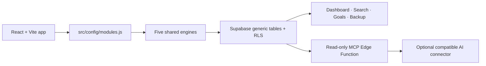

# Everyday

> **Everyday is a personal operating system for daily life, built from reusable tracking engines rather than dozens of isolated apps.**

## The problem

Daily life is usually split between a calorie counter, budget app, habit tracker, task list, link saver, reminders, and more — each with its own data and its own idea of what matters. Moving between them means repeatedly rebuilding context, while the question that actually matters — “how is my week going?” — has no single answer. The data is there, but it is siloed, so it is hard to see patterns or reflect before the next decision. Everyday brings those records into one app, one data model, and one place to get useful answers instead of another pile of logs.

## The solution

Everyday solves this with two layers.

**Layer one: the application layer.** More than 40 daily-life tools live in one place: budget, calories, habits, tasks, saved links, reminders, and more. They are built on five reusable engines rather than 40 separate rewrites. See [What’s inside](#whats-inside) below.

**Layer two: the metacognitive layer.** A read-only MCP server lets Claude or ChatGPT reason directly over that data. People already review a budget or calorie trend to understand their patterns — often with an AI’s help. This layer lets that AI pull the real data directly instead of making someone copy-paste numbers into a chat by hand.

Beyond bringing everything into one place, this design solves two problems most “all-in-one” apps do not:

1. **Zero setup for the user.** No server to run and nothing to deploy: open one configured HTML file, and data reads and writes directly to the cloud. This matters more than it sounds. A good idea that requires real setup effort loses most people before they ever use it; tell ten people “this app is great, but you need to configure a server first,” and most will not bother. Tell them “click this one file,” and they will. Everyday is built for the second version.

2. **One place instead of a dozen.** A saved Instagram reel sits in a chat thread. A packing list lives in Notes. A watchlist is pinned on a movie site that rarely gets opened. Budget lives in one subscription app, calories in another. Nothing talks to anything else, and finding any one thing means remembering which silo it is in. Everyday exists so all of that lives in one place, with one shared way to actually use it.

## Layer two in detail — your data, wherever you already think

Everyday exposes a user’s own data to Claude and ChatGPT through a real, read-only MCP server, secured with a revocable personal token. Someone can ask “How is my week going?” or “Check my goal progress” and get an answer grounded in their actual calories, spending, habits, tasks, and reminders.

Both Claude and ChatGPT were connected and verified end-to-end during development. That testing found a real issue: an AI noticed that a 73.2 kg weight record was being reported as 100% complete toward a 70 kg goal. The bug was in the descending-goal calculation, not the demo data; it was fixed and covered by a regression test.

The result is not a feature bolted onto a tracker. It is the reflection layer the application data was built to support.

## What's inside

### 📊 Trackers (EntryTracker)

Log a number and see the right view of it over time: daily totals, running trends, category breakdowns, or snapshots.

Calories · Budget · Water Intake · Weight · Steps · Time Tracking · Subscriptions · Savings Goal · Net Worth · Investments

### ✅ Lists (Checklist)

Capture an item, keep it organised, and check it off without losing its completed history.

Todo · Grocery List · Watchlist · Bucket List · Gift Ideas

### 🔥 Streaks (StreakTracker)

Check in for today, protect the chain, and review the days you showed up.

Exercise · Medication · Meditation · Habit Tracker · Language Learning · Skill Practice · Gratitude Log

### 💾 Saved (SavedItems)

Keep useful references with notes, tags, and fields that make them easy to find later.

Link Saver · Journal · Reading List · Contacts · Recipe Box · Idea Inbox · Quote Collector

### 📅 Reminders (DueDateTracker)

See what is due next, what is overdue, and what has already been completed.

Debt Payoff · Remittance Log · Chore Schedule · Package Tracker · Warranty Tracker · Document Expiry · Vehicle Maintenance · Course Tracker

### Plus the meta layer

Dashboard · Goals · Global Search · Backup / Export / Import · Connect to AI (read-only MCP)

**41 catalog features, five reusable engines.** The 37 engine modules are configuration entries rather than 37 separate rewrites; the meta layer works across them.

The catalog contains **37 engine modules**: the 36 planned core modules plus Investments, an additional tracker. Combined with the four original catalog meta features—Dashboard, Goals, Global Search, and Backup/Import—that is **41 built/configured catalog features overall**. Connect to AI/MCP is an additional integration surface and is not included in that catalog count.



| Engine | Examples |
|---|---|
| EntryTracker | Calories, Budget, Weight, Savings, Investments |
| Checklist | Todo, Grocery, Watchlist |
| StreakTracker | Exercise, Habits, Gratitude |
| SavedItems | Links, Journal, Contacts, Recipes |
| DueDateTracker | Packages, Chores, Documents, Courses |

## Quick Start — core UI preview

For a fast, no-account preview of the interface, install the committed dependencies and build the self-contained frontend:

```bash
npm ci --ignore-scripts --audit=false
npm run build
```

Open `dist/index.html` directly in a browser. The module navigation and frontend UI load without a Supabase project; data persistence and live records require the setup below. For a working core app backed by your own data, continue with the full setup rather than treating this preview as a complete installation.

## Advanced setup — working Supabase app + MCP server

Follow this sequence in order for a fresh Supabase project. It includes the MCP fixes required for the working deployment: anonymous auth, RLS grants, No auth connector support, token lookup, data reads, and goal calculations.

### 1. Prerequisites

- Node.js 18 or newer and npm.
- A Supabase account.
- A new Supabase project you control. Everyday does not create a project for you.

### 2. Clone and install

```bash
git clone YOUR_REPOSITORY_URL everyday
cd everyday
npm ci --ignore-scripts --audit=false
```

`npm ci` uses the committed lockfile. `--ignore-scripts` and `--audit=false` make installation predictable; run audits separately if desired. This repository’s working agreement requires developers to review and approve dependency installation themselves.

### 3. Create and configure Supabase

1. In the Supabase Dashboard, create a new project and wait until it is ready.
2. In **Project Settings → API**, copy the project URL and the browser-safe anon/publishable key.
3. In **Authentication**, enable **Anonymous Sign-Ins**. The app uses `signInAnonymously()` to create its private anonymous user; it cannot work without this setting.
4. Copy `.env.example` to `.env` at the repository root:

   ```dotenv
   VITE_SUPABASE_URL=https://YOUR_PROJECT_REF.supabase.co
   VITE_SUPABASE_ANON_KEY=YOUR_SUPABASE_ANON_KEY
   ```

Never put a service-role key in `.env`, a `VITE_` variable, frontend code, screenshots, or a public connector URL.

### 4. Run the database SQL in this exact order

Open your project’s **Supabase SQL Editor**. Paste and run each file once, in order:

1. `supabase/schema.sql`
2. `supabase/core-migration.sql`
3. `supabase/checklist-history-migration.sql`
4. `supabase/due-history-migration.sql`
5. `supabase/streak-habits-migration.sql`
6. `supabase/goals-rich-migration.sql`
7. `supabase/mcp-access-tokens-migration.sql`
8. `supabase/migrations/20260721180000_mcp_service_role_token_lookup.sql`
9. `supabase/migrations/20260721183000_mcp_read_only_data_grants.sql`
10. `supabase/migrations/20260721190000_demo_seed_service_role_write_grants.sql`

This order is safe on a fresh project. The schema/migrations use `IF NOT EXISTS`, safe duplicate grants, and policy replacement where needed. The two final MCP migrations are intentionally retained even though the current baseline SQL includes the same grants: they make both fresh and previously initialized projects safe.

Why the final MCP steps matter:

- `mcp_access_tokens` stores only a SHA-256 token hash and is protected by owner-scoped RLS.
- The Edge Function gets **read-only** `service_role` access to that token table, so it can resolve a token owner.
- The MCP Edge Function performs only read queries against entries, checklists, streaks, saved items, due items, and goals. The same server-only service-role key also has controlled write grants for the local demo-seed script; it is never exposed to a connector or browser.
- The local demo-seed script receives `SELECT`, `INSERT`, and `UPDATE` through the service-role key so it can perform deterministic upserts. This key must never be exposed to the browser or MCP connector.

### 5. Verify the browser app before deploying MCP

```bash
npm run dev
```

Open the local URL shown by Vite. The first load should establish an anonymous session. Add a test entry, refresh, and confirm it persists. If anonymous sign-in fails, revisit step 3 before continuing.

You can also run the automated suite and production build:

```bash
npm test
npm run build
```

`vite-plugin-singlefile` creates `dist/index.html`. It can be opened directly, although Supabase persistence still needs network access.

### 6. Deploy the MCP Edge Function

The committed [supabase/config.toml](supabase/config.toml) contains the required per-function setting:

```toml
[functions.everyday-mcp]
verify_jwt = false
```

This is required because ChatGPT/Claude No auth connectors send no Supabase user JWT. The function performs its own hashed personal-token check instead.

Deploy from the repository root:

```bash
npx supabase login
npx supabase link --project-ref YOUR_PROJECT_REF
npx supabase functions deploy everyday-mcp
```

For hosted Supabase Edge Functions, `SUPABASE_URL` and `SUPABASE_SERVICE_ROLE_KEY` are available server-side. Do not copy either into the frontend. If you configure `MCP_ALLOWED_ORIGINS`, include only browser origins that should call the function; leave it unset for normal server-side AI connectors and command-line verification.

### 7. Generate a personal MCP token

In Everyday, open **Connect to AI** and generate an access token. The full token is displayed once.

- Use the raw token for direct clients that support `Authorization: Bearer …`.
- Use the generated full `?token=…` connector URL for a connector that offers only **No auth**.

The URL contains the secret token. Do not share it. Revoke the token in Everyday if it is exposed.

### 8. Verify the deployed MCP server immediately

The verifier performs no writes. It checks:

1. MCP initialization.
2. `tools/list` and all six read-only tools.
3. `get_weekly_summary`, which reads every shared MCP table and catches missing data-table grants.
4. `get_goal_progress`, which catches the goals-table path that previously failed.

#### PowerShell

```powershell
$env:MCP_URL = 'https://YOUR_PROJECT_REF.supabase.co/functions/v1/everyday-mcp'
$env:MCP_TOKEN = Read-Host 'Paste the fresh MCP token'
$env:MCP_AUTH_MODE = 'query' # tests the No auth connector path
npm run verify:mcp
Remove-Item Env:MCP_TOKEN
```

#### Bash/zsh

```bash
export MCP_URL='https://YOUR_PROJECT_REF.supabase.co/functions/v1/everyday-mcp'
read -rsp 'Paste the fresh MCP token: ' MCP_TOKEN; echo
export MCP_TOKEN
export MCP_AUTH_MODE=query # tests the No auth connector path
npm run verify:mcp
unset MCP_TOKEN
```

Set `MCP_AUTH_MODE=bearer` to test the direct Bearer-header path instead. A successful run prints `MCP verification passed`; it does not print the token.

### 9. Connect an AI client

The server accepts either form of authentication:

- `Authorization: Bearer YOUR_TOKEN` for direct API clients.
- `https://YOUR_PROJECT_REF.supabase.co/functions/v1/everyday-mcp?token=YOUR_TOKEN` when no Authorization header is supplied.

ChatGPT and Claude custom-connector UIs provide full OAuth or No auth, not a field for a raw Bearer token. Full OAuth is not implemented. For No auth, paste the full generated connector URL and select **No auth**.

Manual testing during this project work confirmed a ChatGPT No auth connector could connect and list the six tools. Re-run step 8 after every deployment. Claude compatibility has not been manually verified here.

## The MCP fixes this repository preserves

Do not revert these behaviors when changing the server:

- **No platform JWT block:** `verify_jwt = false` is scoped only to `everyday-mcp`; the handler authenticates every request with a hashed, revocable token.
- **Correct internal API key placement:** the Edge Function sends its server credential only in the `apikey` header. It does not send the service key as a Bearer `Authorization` value, because that is not a user JWT.
- **Safe query-token fallback:** a Bearer header is used first; `?token=` is considered only when no header is present. A query token cannot override an invalid header.
- **Required table grants:** the MCP token lookup and every read-only tool table have explicit `service_role` `SELECT` grants. The separate demo-seed migration adds `INSERT`/`UPDATE` only for the local seed workflow; it does not add MCP write tools.
- **Safe error handling:** errors return normal MCP errors; token hashes, stack traces, and secret diagnostics are never exposed in HTTP responses.
- **Direction-aware goals:** Weight is a descending goal using its first recorded snapshot as baseline; Savings and Net Worth remain ascending. The regression suite verifies the earlier 100%-for-weight bug cannot return.

## Why Everyday is different

- **Config-driven modules:** the catalog defines engine, fields, units, aggregation, charts, filters, and profile behavior.
- **Shared generic data model:** generic tables support the catalog instead of a table per app.
- **Anonymous-user isolation:** Supabase RLS scopes each anonymous user’s data to their own `user_id`.
- **Single-file frontend:** Vite produces one portable HTML file.
- **Read-only AI context:** MCP can answer questions about a user’s data but has no write tools.

The implementation is pragmatic rather than perfectly abstract: configuration drives most behavior, while richer experiences such as Calories, Budget, subscriptions, and Investments retain profile-specific presentation branches. See [Architecture](docs/ARCHITECTURE.md).

## Demo data

`demo-everyday-backup.json` contains non-sensitive records across configured modules.

1. Open **Backup** in Everyday.
2. Choose **Import JSON backup**.
3. Select `demo-everyday-backup.json` and confirm.

Import is additive, so importing the same file twice creates duplicates. It rewrites ownership, IDs, and creation timestamps for the current anonymous user. Debt-payment rows therefore cannot preserve links to newly generated debt IDs; create debt payments in the app when demonstrating that relationship.

For a larger, repeatable local demo dataset, use the deterministic seed script. It needs a local service-role key and the target anonymous user ID; do not place either value in `.env` or paste it into a chat.

```powershell
$env:SUPABASE_URL = 'https://YOUR_PROJECT_REF.supabase.co'
$env:SUPABASE_SERVICE_ROLE_KEY = Read-Host 'Paste service-role key'
$env:EVERYDAY_SEED_USER_ID = 'YOUR_EXISTING_ANONYMOUS_USER_ID'
npm run seed:demo                 # preview: no database writes
node scripts/seed-demo-data.mjs --apply
Remove-Item Env:SUPABASE_SERVICE_ROLE_KEY
```

The script upserts approximately 3,013 fictional rows with fixed IDs, so rerunning it is safe and does not duplicate its own demo data. It never deletes existing records. Run `npm run verify:mcp` afterwards to verify the deployed read-only tools against the seeded account. Before its first write, run `supabase/migrations/20260721190000_demo_seed_service_role_write_grants.sql` in the Supabase SQL Editor.

## Known limitations

- Desktop is the supported target; a dedicated mobile layout is out of scope.
- Generic engines retain some module/profile-specific UI branches.
- App list/history pages use page-size limits; MCP scans are capped and module-history responses are paginated, so unusually large datasets need deliberate scale testing.
- Backup import is additive and has the ID/timestamp/debt-link limitations described above.
- Query-token connector URLs can expose a token in connector settings, browser history, or logs. OAuth is not implemented.
- Not every module has a recorded live end-to-end verification in the repository.

See [all known limitations](docs/KNOWN_LIMITATIONS.md) and [full MCP protocol details](docs/MCP.md).

## License

This project is licensed under [MIT-0](LICENSE).

## How Codex / GPT-5.6 was used

Codex was the implementation partner throughout the project: shaping the reusable-engine architecture, reviewing module gaps, extending tests, diagnosing Supabase/RLS and MCP failures from live error evidence, and producing the reproducible deployment runbook above. The MCP fixes are concrete examples: token lookup grants, read-only data grants, query-token authentication, correct API-key placement, and direction-aware goal progress all came from live debugging and regression tests.

For hackathon evidence, submit feedback from the final Codex session with `/feedback`, then replace this placeholder before submission:

```text
Codex feedback session ID: 019f701e-537e-7c12-865c-cbf9c1b4a055
```

## Suggested 3–5 minute demo

1. Dashboard: cross-module snapshot and attention items.
2. Calories: food, burn, deficit, and history.
3. Budget: net cash flow, categories, analytics, and history.
4. Todo archive history or Habit contribution history.
5. Global Search, then Connect to AI after step 8 has passed.

Use [Demo Guide](docs/DEMO_GUIDE.md) as the recording checklist.
