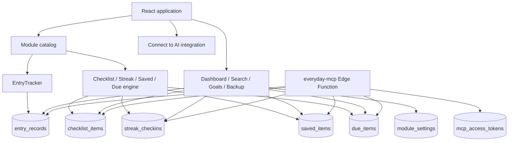

# Architecture

## System overview

## Module catalog

`src/config/modules.js` is the catalog. Each module has an ID, title, icon, accent, engine, field configuration, and optional behavior profile. App navigation and Dashboard cards are generated from this catalog.

The catalog has 37 engine modules: 36 originally planned modules plus Investments. It also has four catalog meta features, for 41 configured features overall. Connect to AI/MCP is implemented as an auxiliary integration and is intentionally not included in that count.

## Shared engines

### EntryTracker

**Table:** `entry_records`
**Modules:** Calories, Budget, Water intake, Weight, Steps, Time tracking, Subscriptions, Savings goal, Net worth, Investments.

Core configuration includes value label/unit/format, aggregation (`sum` or `latest`), period (`calendar_day` or `all_time`), goals, chart type, currency options, and custom fields. History queries use `occurred_at` and support ranges, sorting, and text search.

Important profiles in `TrackerSuite` add specific experiences for water units, weight goal pace, time projects, subscription lifecycle, savings forecast, net-worth accounts, and investment accounts/snapshots. Calories uses its own rich component for meal/burn/skip/clear-day behavior. Budget uses its own finance experience for income/expense analysis and conversion display.

### Checklist

**Table:** `checklist_items`
**Modules:** Todo, Grocery list, Watchlist, Bucket list, Gift ideas.

The generic shape is title, `is_complete`, completion/archive timestamps, and JSON `fields`. Config supplies field definitions, grouping, filters, status transitions, and link fields. Completed checklist rows can be archived rather than deleted, preserving history.

### StreakTracker

**Table:** `streak_checkins`
**Modules:** Exercise, Medication, Meditation, Habit tracker, Language learning, Skill practice, Gratitude log.

Each row stores `completed_on`, note, fields, and `habit_key`. The shared UI provides check-in history and a calendar-style contribution view. Habit tracker is the special named-scope variant: multiple habits can have a check-in on the same date because uniqueness includes `habit_key`.

### SavedItems

**Table:** `saved_items`
**Modules:** Link saver, Journal, Reading list, Contacts, Recipe box, Idea inbox, Quote collector.

The shared shape is title, content, tags, metadata, and created date. Config controls metadata fields, auto-detected link type, filter choices, and safe URL rendering. Archived state is represented in metadata for this engine.

### DueDateTracker

**Table:** `due_items`
**Modules:** Debt payoff, Remittance log, Chore schedule, Package tracker, Warranty tracker, Document expiry, Vehicle maintenance, Course tracker.

The generic shape is title, `due_at`, `is_complete`, `completed_at`, and metadata. Config supplies module fields, safe links, recurrence, and debt-ledger behavior. A recurring chore completion preserves the old row and creates/uses a future occurrence rather than overwriting the historical occurrence.

## Detail and history pattern

Engine pages present a composer/overview plus a shared history experience. `HistoryView` provides range controls, sort controls, text search, and configurable filter slots. The generic list engine uses page-size-limited queries with Load More; entry history is bounded/paginated in its data helpers.

## Meta features

### Dashboard

Dashboard reads all engine tables for the active anonymous user and derives a snapshot per configured module. Examples include Calories today, Budget monthly expenses, current streak, active checklist count, latest Weight, and account-aware Net Worth. It also surfaces overdue/upcoming due items.

### Global Search

Global Search reads records across entry, checklist, streak, saved, and due tables. It supports engine/module filtering and searches titles, notes, fields, metadata, tags, and saved-item information. A result opens its module rather than a separate record-detail route.

### Goals

Goals currently support compatible EntryTracker modules. The calculation is intentionally module-aware: Budget is income minus expenses; Savings subtracts withdrawals; Weight and Net Worth use latest snapshot behavior; Investments excludes portfolio snapshots. Lists, streaks, saved items, due-date modules, and subscriptions are not goal-compatible today.

### Backup / Import

Backup exports generic tables and settings as JSON. Import validates/stages the full payload, writes records, and rolls back newly inserted rows if a later insert fails. It is additive rather than replace-all; IDs and created timestamps are sanitized to protect account ownership.

### Connect to AI

Connect to AI manages user-owned personal access tokens. The client generates a token, saves only its hash, shows the plaintext once, and can revoke it. The companion Edge Function is separate deployment work.

## Design tradeoff

Everyday is **config-driven architecture with pragmatic experience-specific branches**. The catalog and generic data tables prevent one engine/table per module, but profile and module branches exist where a generic form would be too weak—for example Calories, Budget, subscriptions, investments, debt ledger, named habits, and safe links.

## Current architectural limitations / future refactors

- Move more profile logic out of `TrackerSuite` and `GenericEngines` into declarative behavior strategies.
- Introduce a typed schema/validation layer shared by form input, imports, and MCP normalization.
- Add database-backed pagination/counts for large Dashboard and Search datasets.
- Add a true transaction/server-side strategy for backup import instead of client-managed compensating rollback.
- Treat mobile as a separate product design rather than extending desktop media queries incrementally.
- Verify the MCP deployment boundary and remote-client compatibility in a real Supabase project.
