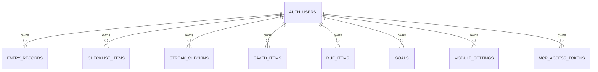

# Data model and privacy

Everyday uses generic tables keyed by `module_id`; it does not create one table per feature. Every application row belongs to an anonymous Supabase user through `user_id`.

## Authentication and row-level security

The browser calls `signInAnonymously()` when no session exists. Each table uses `user_id = auth.uid()` RLS policies for the authenticated role, so an anonymous account can only select, insert, update, or delete its own rows.

Anonymous auth is privacy isolation, not a recoverable login system: clearing browser storage can create a different anonymous identity. No password/notes vault is included; it is explicitly out of scope for a public/shared hackathon project.

## Tables

| Table | Purpose | Used by |
|---|---|---|
| `entry_records` | Numeric time-series records | EntryTracker modules |
| `checklist_items` | Checklist rows and archive history | Checklist modules |
| `streak_checkins` | Dated check-ins | StreakTracker modules |
| `saved_items` | Searchable references | SavedItems modules |
| `due_items` | Due-date records and completion history | DueDateTracker modules |
| `goals` | Cross-module EntryTracker goals | Goals |
| `module_settings` | Per-user/per-module preferences | Tracker and finance settings |
| `mcp_access_tokens` | Hashed personal access tokens | Connect to AI / MCP |

### `entry_records`

Key columns: `id`, `user_id`, `module_id`, numeric `value`, `occurred_at`, `note`, JSONB `fields`, JSONB `metadata`, `created_at`, `updated_at`.

`entry_records_owner_module_time_idx` supports owner/module/time history. Typical conventions:

- Budget: `metadata.transactionType` is `income` or expense; `fields.category` stores category.
- Calories: `metadata.kind` distinguishes `calorie_burn` and `day_skip`; `fields.meal` and duration provide context.
- Savings: `metadata.kind: withdrawal` offsets contributions.
- Subscriptions: `metadata.kind` distinguishes subscription definition and charge records.
- Investments: `metadata.kind: portfolio_snapshot` distinguishes value snapshots from contributions.
- Net worth: `fields.account` and `fields.type` distinguish assets and liabilities.
- Recoverable clear/skip behavior uses `metadata.archived_at` rather than deleting records.

### `checklist_items`

Key columns: `title`, `is_complete`, `completed_at`, `archived_at`, JSONB `fields`, and `created_at`.

The checklist history migration adds completion/archive timestamps and an owner/history index. Active lists hide archived rows; archive preserves the row for completed history. The generic UI still has a permanent delete action for non-archive cases, so users should understand the difference.

### `streak_checkins`

Key columns: `module_id`, `completed_on` date, `note`, JSONB `fields`, `habit_key`, and `created_at`.

The habits migration changes uniqueness from `(user_id, module_id, completed_on)` to `(user_id, module_id, habit_key, completed_on)`. Non-named streak modules use `habit_key = 'default'`; the Habit tracker uses its named habit. This table drives contribution history and current/best streak calculations.

### `saved_items`

Key columns: `title`, `content`, `tags` text array, JSONB `metadata`, and `created_at`.

Metadata contains feature fields such as URL/type/status, reading progress, contact fields, ingredients, or quote source. Saved-item archive/favorite state is conventionally held in metadata. URL display is validated to safe `http:`/`https:` links in the UI.

### `due_items`

Key columns: `title`, `due_at`, `is_complete`, `completed_at`, JSONB `metadata`, and `created_at`.

The due-history migration adds completion timestamp/index support. Metadata stores package tracking links, recurrence fields, debt source amount, and payment-ledger metadata. Completion history remains as rows; recurring chores should create/preserve occurrences instead of rewriting past due dates.

### `goals`

Key columns: `module_id` (currently `goals`), `title`, `target_module_id`, `target_value`, `target_unit`, `due_at`, `is_complete`, and `created_at`.

`goals-rich-migration.sql` adds the measurable columns. Goal values are derived from EntryTracker records, not copied into the goal row.

### `module_settings`

Composite primary key: `(user_id, module_id)`. The JSONB `settings` object holds module preferences such as calorie target/deficit mode, unit selection, weight target/date, savings target/date, and Budget limits/currency display settings. Updates are upserts by the application.

### `mcp_access_tokens`

Key columns: `id`, `user_id`, `token_hash`, `token_prefix`, optional `label`, `created_at`, `revoked_at`. `token_hash` is unique and constrained to 64 SHA-256 hex characters. The table has an active-hash lookup index and an owner/date index. RLS allows owners to manage only their tokens.

The plaintext token is generated client-side and displayed once. It is never stored in the table.

## History and retention

- **Checklist:** completed rows can be archived, retaining `completed_at` and `archived_at`.
- **Due dates:** completed rows retain `completed_at`; recurring work should leave prior occurrences visible.
- **Streaks:** every check-in is dated with `completed_on` and feeds calendar history.
- **Entry trackers:** clear/skip actions use metadata archive markers where implemented so history can be restored.
- **Saved items / due items:** archive behavior is represented in metadata or archive state rather than immediate deletion in the shared UI path.

## Backup and import

Backup covers entry records, checklist items, streaks, saved items, due items, goals, and module settings. Import stages and validates table-shaped arrays, rewrites `user_id` to the current anonymous account, and attempts rollback of newly inserted rows if a later operation fails.

Important limitations:

- Import is additive; it does not deduplicate existing rows.
- It strips IDs, `created_at`, and `updated_at`. Imported creation dates become current database defaults.
- It cannot safely prelink a debt-payment row to a newly generated debt ID. Add those ledger payments in the app after importing.
- Client-side compensating rollback is useful but not the same as one database transaction.
